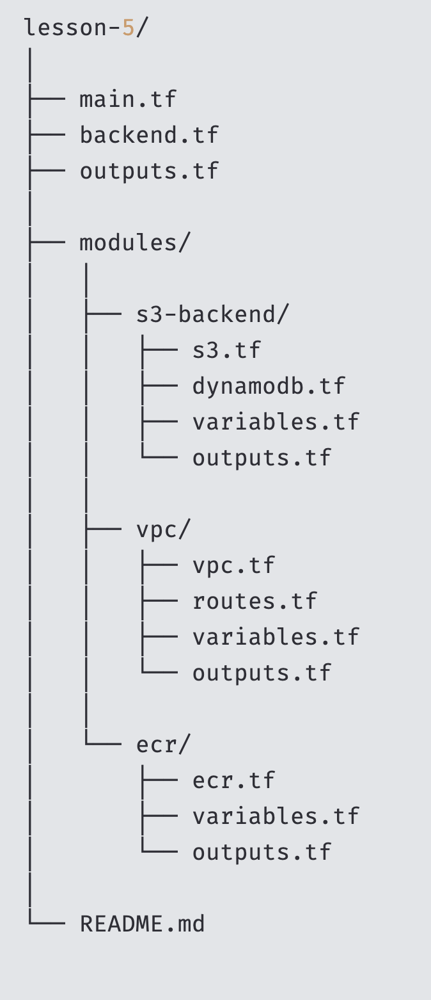
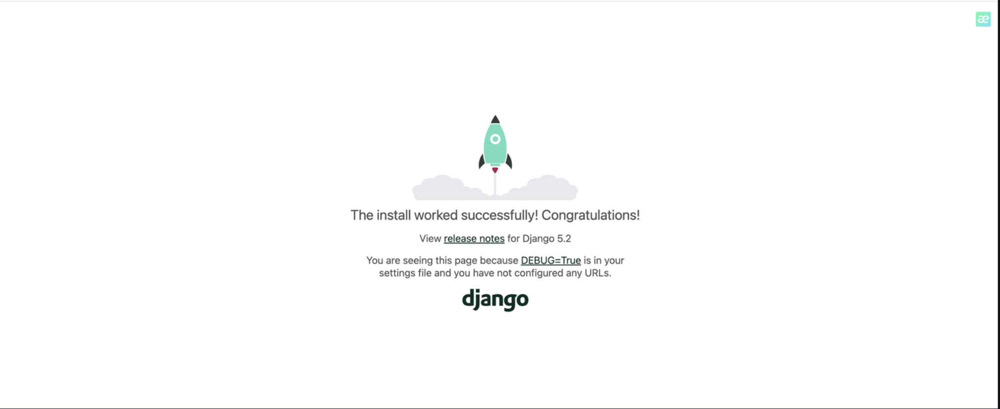
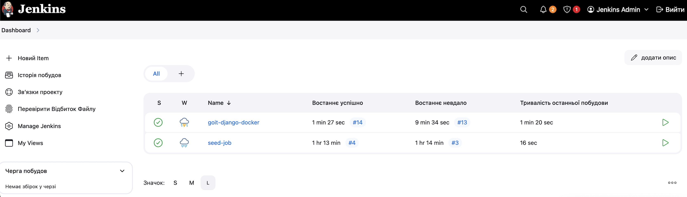
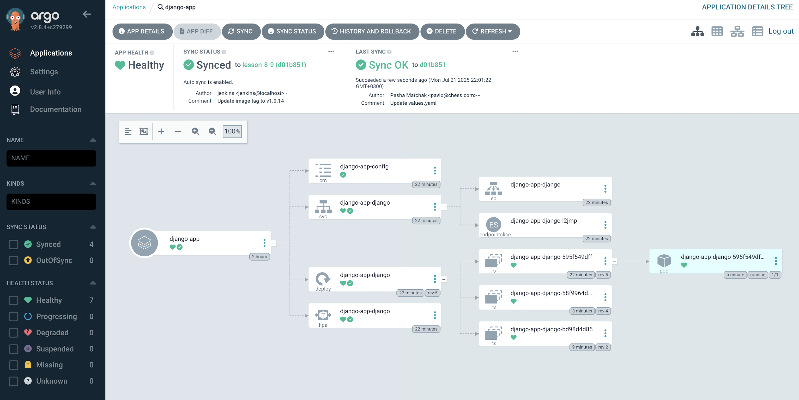

main.tf — головний файл для виклику модулів.

backend.tf — конфігурація віддаленого бекенду (S3 + DynamoDB).

outputs.tf — вивід результатів з усіх модулів.

modules/ — каталог з модулями:

- s3-backend/ — модуль для створення S3 бакету та DynamoDB для Terraform бекенду.

- vpc/ — модуль для створення VPC, маршрутів тощо.

- ecr/ — модуль для створення ECR репозиторію з політикою доступу.

Команди для ініціалізації запуску


# Django App Deployment on AWS EKS

## Prerequisites

Before starting, ensure you have the following installed and configured:

- ✅ AWS account with sufficient permissions  
- ✅ AWS CLI configured (`aws configure`)  
- ✅ Docker installed and running  
- ✅ `kubectl` installed  
- ✅ Helm installed  
- ✅ Terraform installed  

---

## Terraform Commands

```bash
terraform init
```

```bash
terraform plan
```

```bash
terraform apply
```

```bash
terraform destroy
```

## Збірка та завантаження Docker Image до ECR

### Аутентифікація Docker в ECR

```bash
aws ecr get-login-password --region <your-region> | docker login --username AWS --password-stdin <your-account-id>.dkr.ecr.<your-region>.amazonaws.com
```

### Створення Docker image

```bash
docker build -t lesson-8-9 .
```

### Додавання тега до image

```bash
docker tag lesson-8-9:latest <your-account-id>.dkr.ecr.<your-region>.amazonaws.com/lesson-8-9-ecr-818682288271:latest
```

### Завантаження image до ECR

```bash
docker push <your-account-id>.dkr.ecr.<your-region>.amazonaws.com/lesson-8-9-ecr-818682288271:latest
```

---

## Конфігурація `kubectl`

### Оновлення kubeconfig для EKS кластеру

```bash
aws eks --region <your-region> update-kubeconfig --name <your-cluster-name>
```

### Перевірка доступу до кластеру

```bash
kubectl get nodes
```

---

## Деплой Django App за допомогою Helm

### Перейти до Helm chart директорії

```bash
cd charts/django-app
```

### Оновити `values.yaml`, додати ECR image repository та тег.

### Встановлення Helm chart

```bash
helm install django-app .
```

### Отримати зовнішній URL

```bash
kubectl get svc
```

Знайдіть `EXTERNAL-IP` для сервісу `django-app-django`.

### Відкрити Django App у браузері



### Jenkins



### Argo_cd



## Очищення ресурсів

```bash
helm uninstall nat
```

```bash
terraform destroy
```
